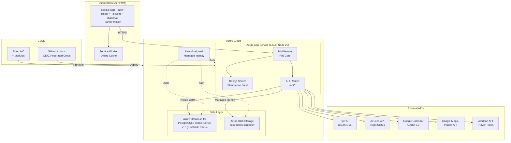
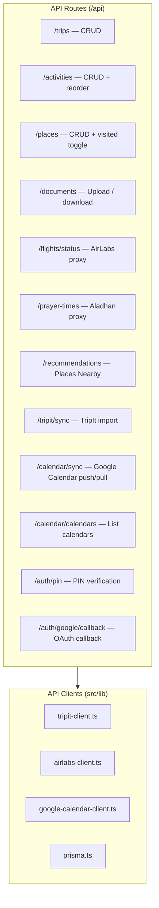
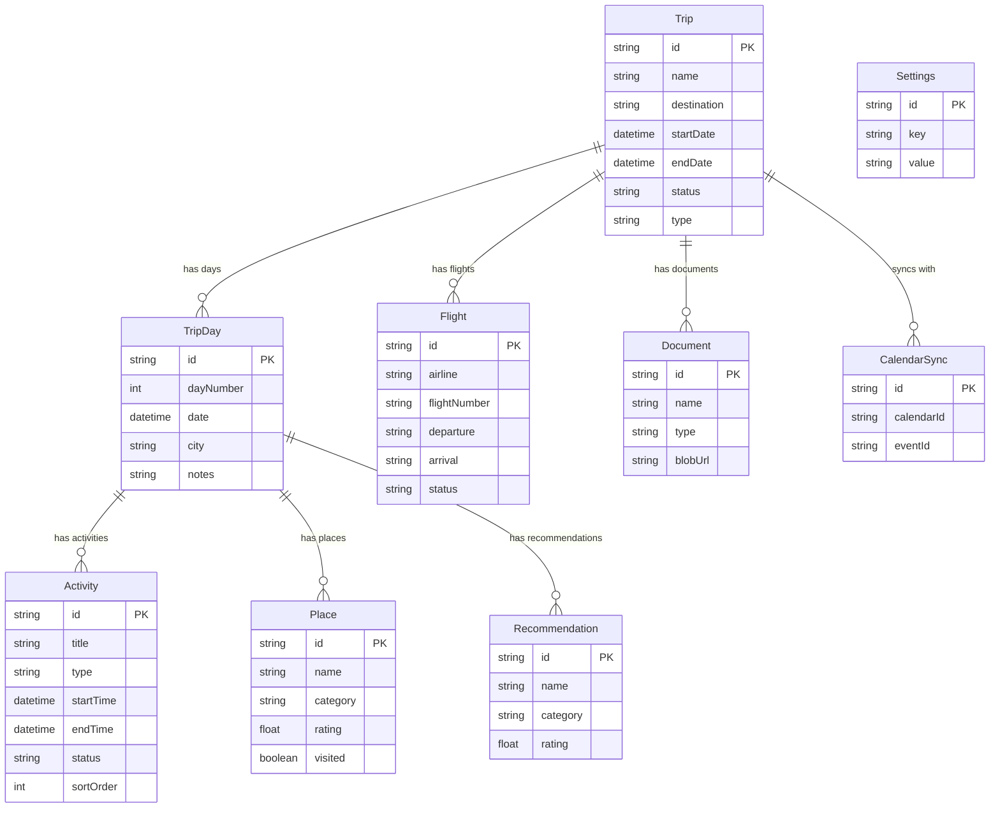
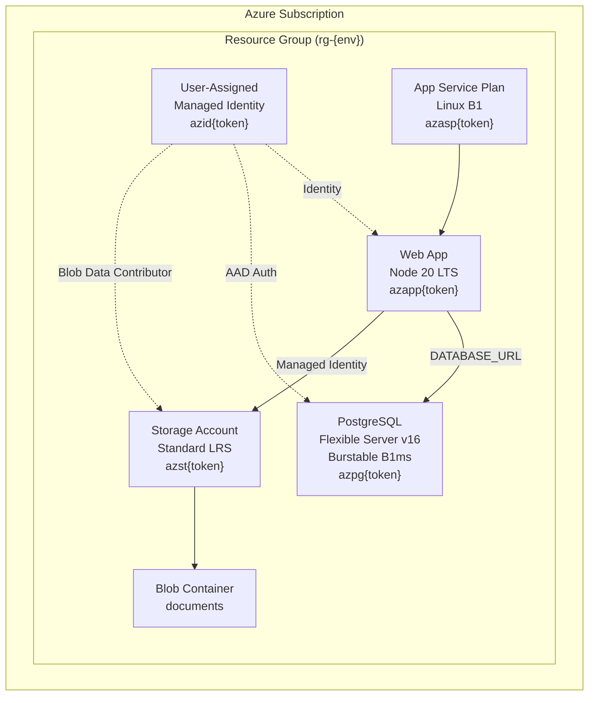
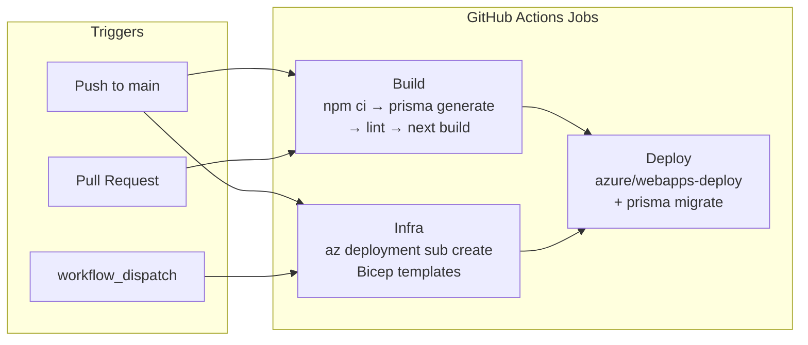

## System Architecture

## Component Breakdown

### Frontend Layer

```mermaid
graph LR
    subgraph Pages["App Router Pages"]
        DASH["/ Dashboard"]
        TRIP["/trip/[id]"]
        ITIN["/itinerary"]
        PLACES["/places"]
        DISC["/recommendations"]
        FLT["/flights"]
        DOCS["/documents"]
        UMRAH["/umrah"]
        SETT["/settings"]
        PIN["/pin"]
    end

    subgraph Components["Shared Components"]
        NAV["Sidebar / BottomNav"]
        TRIP_CARD["TripCard"]
        ACT_CARD["ActivityCard"]
        FLT_CARD["FlightCard"]
        PLACE_CARD["PlaceCard"]
        DOC_CARD["DocumentCard"]
        PRAYER["PrayerTimesWidget"]
        UMRAH_CL["UmrahChecklist"]
        DND["SortableActivityList<br/>@dnd-kit"]
    end

    Pages --> Components
```

### API Layer

### Data Model

### Azure Infrastructure

### CI/CD Pipeline

## Design Principles

* **Kid-friendly UI** — Vibrant colors, rounded shapes, playful animations, and large touch targets suitable for family members of all ages
* **Mobile-first** — Responsive design that works seamlessly on phones and tablets while traveling
* **Offline-capable** — Service worker caches pages and static assets for use without connectivity
* **Zero-password infrastructure** — All Azure services authenticate via Managed Identity; no connection strings or passwords stored in configuration
* **Infrastructure as Code** — All Azure resources defined in Bicep, deployable via `azd up` or `az deployment sub create`
* **Continuous delivery** — Every push to `main` provisions infrastructure and deploys automatically through GitHub Actions with OIDC
